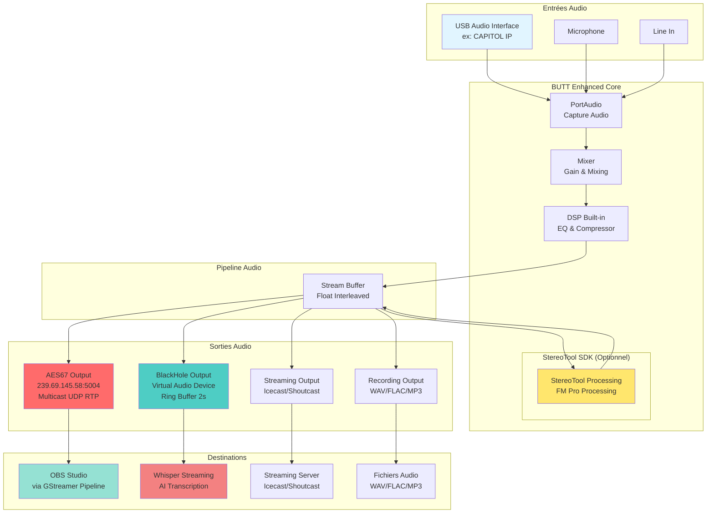

# 🏗️ Architecture - BUTT Enhanced

## Vue d'ensemble

BUTT Enhanced est une version améliorée de BUTT qui ajoute des fonctionnalités professionnelles pour la diffusion audio, notamment le support AES67 et BlackHole.

---

## 📊 Diagramme d'Architecture

### Diagramme Mermaid



### Diagramme ASCII (Alternative)

```
┌─────────────────────────────────────────────────────────────────┐
│                    BUTT Enhanced Architecture                    │
└─────────────────────────────────────────────────────────────────┘

┌─────────────────┐
│  Entrées Audio  │
├─────────────────┤
│  USB Audio      │──┐
│  (CAPITOL IP)   │  │
│                 │  │
│  Microphone     │──┤
│                 │  │
│  Line In        │──┘
└─────────────────┘
         │
         ▼
┌─────────────────────────────────────────────────────────────────┐
│                    BUTT Enhanced Core                            │
├─────────────────────────────────────────────────────────────────┤
│                                                                  │
│  ┌──────────────┐    ┌──────────────┐    ┌──────────────┐     │
│  │ PortAudio    │───▶│   Mixer      │───▶│  DSP Built-in │     │
│  │  Capture     │    │  Gain/Mix    │    │  EQ/Compress  │     │
│  └──────────────┘    └──────────────┘    └──────────────┘     │
│         │                                                      │
│         ▼                                                      │
│  ┌──────────────────────────────────────────────────────┐    │
│  │         Stream Buffer (Float Interleaved)             │    │
│  └──────────────────────────────────────────────────────┘    │
│         │                                                      │
│         ▼                                                      │
│  ┌──────────────────────────────────────────────────────┐    │
│  │      StereoTool SDK (Optionnel)                       │    │
│  │      - FM Pro Processing                              │    │
│  │      - Bypass on Silence                              │    │
│  │      - VU Meters (Pre/Post)                          │    │
│  └──────────────────────────────────────────────────────┘    │
│         │                                                      │
└─────────┼──────────────────────────────────────────────────────┘
          │
          ▼
┌─────────────────────────────────────────────────────────────────┐
│                    Sorties Audio                                │
├─────────────────────────────────────────────────────────────────┤
│                                                                  │
│  ┌──────────────┐  ┌──────────────┐  ┌──────────────┐         │
│  │  AES67       │  │  BlackHole   │  │  Streaming   │         │
│  │  Output      │  │  Output      │  │  Output      │         │
│  │              │  │              │  │              │         │
│  │ Multicast    │  │ Virtual      │  │ Icecast/     │         │
│  │ UDP RTP      │  │ Audio Device  │  │ Shoutcast    │         │
│  │ 239.69.145.58│  │ Ring Buffer   │  │              │         │
│  │ :5004        │  │ 2 seconds    │  │              │         │
│  └──────────────┘  └──────────────┘  └──────────────┘         │
│         │                 │                    │                │
│         │                 │                    │                │
│  ┌──────────────┐  ┌──────────────┐  ┌──────────────┐         │
│  │  Recording   │  │              │  │              │         │
│  │  Output      │  │              │  │              │         │
│  │              │  │              │  │              │         │
│  │ WAV/FLAC/MP3 │  │              │  │              │         │
│  └──────────────┘  └──────────────┘  └──────────────┘         │
│                                                                  │
└─────────────────────────────────────────────────────────────────┘
          │                 │                    │
          ▼                 ▼                    ▼
┌──────────────┐  ┌──────────────┐  ┌──────────────┐
│ OBS Studio   │  │ Whisper     │  │ Streaming    │
│              │  │ Streaming   │  │ Server      │
│ via          │  │ AI          │  │             │
│ GStreamer   │  │ Transcription│  │             │
│ Pipeline     │  │             │  │             │
└──────────────┘  └──────────────┘  └──────────────┘
```

---

## 🔄 Flux de Données

### 1. Capture Audio
```
USB Audio Interface (ex: CAPITOL IP)
    ↓
PortAudio (Core Audio sur macOS)
    ↓
Buffer PCM Float (interleaved)
```

### 2. Traitement Audio
```
Buffer PCM
    ↓
Mixer (Gain & Mixing)
    ↓
DSP Built-in (EQ & Compressor) [optionnel]
    ↓
StereoTool SDK [optionnel]
    ↓
Stream Buffer (Float Interleaved)
```

### 3. Sorties Audio (Parallèles)
```
Stream Buffer
    ├──→ AES67 Output
    │       ↓
    │    Multicast UDP RTP
    │       ↓
    │    OBS Studio (via GStreamer)
    │
    ├──→ BlackHole Output
    │       ↓
    │    Ring Buffer (2s)
    │       ↓
    │    Whisper Streaming
    │
    ├──→ Streaming Output
    │       ↓
    │    Icecast/Shoutcast
    │
    └──→ Recording Output
            ↓
         WAV/FLAC/MP3
```

---

## 🧩 Composants Principaux

### 1. PortAudio (`src/port_audio.cpp`)
- **Rôle** : Capture audio depuis les périphériques
- **Format** : PCM Float, Interleaved
- **Plateforme** : Core Audio (macOS)

### 2. Mixer (`src/port_audio.cpp`)
- **Rôle** : Mixage et gain des sources audio
- **Fonctionnalités** : Gain streaming, gain recording, mixage multiple sources

### 3. DSP Built-in (`src/dsp.cpp`)
- **Rôle** : Traitement audio de base
- **Fonctionnalités** : Equalizer, Compresseur
- **Activation** : Si StereoTool désactivé ou en complément

### 4. StereoTool SDK (`src/stereo_tool.cpp`)
- **Rôle** : Traitement audio professionnel
- **Fonctionnalités** : FM Pro processing, bypass on silence
- **Status** : Optionnel, nécessite licence PRO

### 5. AES67 Output (`src/aes67_output.cpp`)
- **Rôle** : Diffusion audio sur réseau IP
- **Format** : RTP/UDP Multicast, PCM 24-bit L24
- **Destination** : 239.69.145.58:5004 (par défaut)
- **Intégration** : OBS Studio via GStreamer pipeline

### 6. BlackHole Output (`src/blackhole_output.cpp`)
- **Rôle** : Sortie audio virtuelle
- **Format** : Core Audio, Float 32-bit
- **Buffer** : Ring buffer de 2 secondes
- **Destination** : Whisper Streaming, autres applications

### 7. Streaming Output (`src/port_audio.cpp`)
- **Rôle** : Diffusion vers serveurs Icecast/Shoutcast
- **Formats** : Opus, AAC, MP3
- **Codecs** : libopus, libfdk-aac, lame

### 8. Recording Output (`src/port_audio.cpp`)
- **Rôle** : Enregistrement local
- **Formats** : WAV, FLAC, MP3
- **Codecs** : libflac, lame

---

## 🔀 Synchronisation

### Ring Buffers
- **AES67** : Ring buffer pour gestion asynchrone réseau
- **BlackHole** : Ring buffer de 2 secondes pour fluidité
- **Streaming** : Ring buffer pour gestion codec

### Threads
- **Main Thread** : Interface utilisateur, contrôle
- **Audio Thread** : Capture et traitement audio (callback)
- **AES67 Thread** : Envoi réseau asynchrone
- **Streaming Thread** : Encodage et envoi serveur

---

## 📦 Dépendances

### Bibliothèques Audio
- **PortAudio** : Capture audio
- **Core Audio** : API audio macOS
- **libopus** : Codec Opus
- **libfdk-aac** : Codec AAC
- **lame** : Codec MP3
- **libflac** : Codec FLAC

### Bibliothèques Réseau
- **Socket UDP** : Diffusion AES67
- **libcurl** : Streaming HTTP

### Bibliothèques UI
- **FLTK** : Interface graphique

### SDK Externes
- **StereoTool SDK** : Traitement audio professionnel (optionnel, propriétaire)

---

## 🎯 Cas d'Usage

### 1. Diffusion Radio avec OBS
```
USB Audio → BUTT → StereoTool → AES67 → OBS Studio
```

### 2. Transcription en Temps Réel
```
USB Audio → BUTT → StereoTool → BlackHole → Whisper Streaming
```

### 3. Diffusion Multi-Sorties
```
USB Audio → BUTT → StereoTool → ├─→ AES67 (OBS)
                                  ├─→ BlackHole (Whisper)
                                  ├─→ Icecast (Streaming)
                                  └─→ WAV (Recording)
```

---

**Dernière mise à jour** : Janvier 2025

